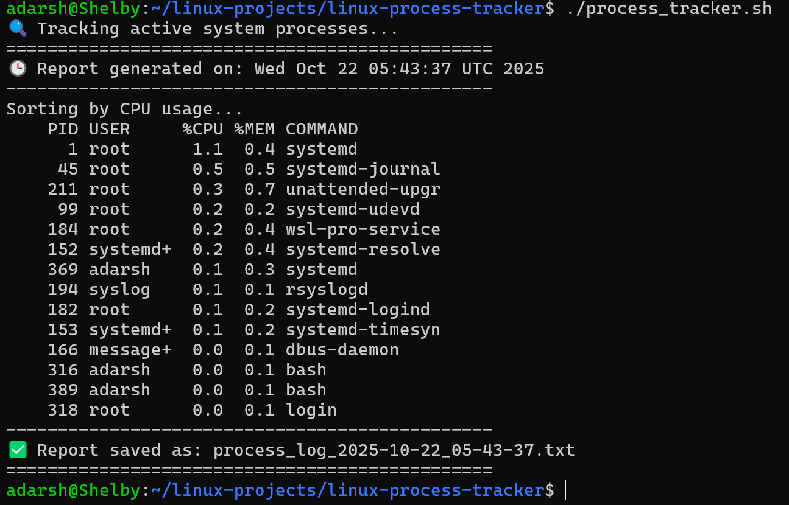

# ⚙️ Linux Process Tracker

### 👨‍💻 Author

**Adarsh Shivan**<br>GitHub: [https://github.com/adarshshivan](https://github.com/adarshshivan)

---

## 📘 Overview
The Linux Process Tracker is a Bash-based monitoring utility that lists all active processes on a system along with their key metrics such as Process ID (PID), user, CPU usage, and memory consumption.
It helps users understand which processes are consuming the most resources and keeps a record for later analysis.
This tool is ideal for system administrators, developers, and Linux learners who want hands-on experience with process management.

---

## 🧰 Features
- Displays all active processes in real time
- Shows PID, user, CPU%, and memory% for each process
- Highlights top CPU and memory-consuming tasks
- Optionally logs process data to a .log file
- Lightweight and compatible with all Linux systems

---

## ⚙️ Tools & Technologies Used
- 🐧 Linux / WSL (Ubuntu)
- 💻 Bash Scripting
- 🧮 ps, awk, sort, and head commands
- 🧾 GitHub (for version control)
- ✍️ VS Code / Nano (for editing scripts)

---

## 🧩 How It Works

1. The script uses core Linux commands to collect and format process details.
2. It performs the following operations step by step:
3. Fetches all active processes using ps -eo pid,user,%cpu,%mem,comm.
4. Sorts them by CPU usage and displays the top processes.
5. Calculates overall CPU and memory consumption.
6. Optionally logs all data into process_report_<date>.log.
7. Prints the final output neatly formatted for easy reading.

---

## ▶️ Usage Instructions

### 1️⃣ Make It Executable
```bash
chmod +x process_tracker.sh
```
### 2️⃣ Run the Script
```bash
bash process_tracker.sh
```

Or (if executable):

```bash
./process_tracker.sh
```

---

### 📂 Example Output

▶️ After Running



---

### 🎓 What I Learned

- Using ps and awk commands to parse live process data
- Sorting and formatting output in Bash
- Understanding process resource management in Linux
- Writing log files dynamically for system monitoring
- Building professional Linux scripts suitable for GitHub portfolios

---

### 🧠 Project Summary

The Linux Process Tracker is a real-time monitoring script that displays process statistics directly from the Linux terminal.
It provides deep insight into system activity, helps diagnose performance issues, and demonstrates practical knowledge of process management.

This project demonstrates proficiency in:

Linux process handling commands

Shell scripting for system monitoring

Command-line data parsing and sorting

Professional Bash automation
